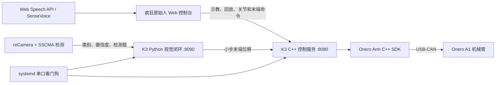

# 疯狂原始人 · Physical AI 机器人平台

“疯狂原始人”是香港 Physical AI Hackathon 的具身机器人项目。系统以 **SpacemiT K3
RISC-V 边缘计算板**为控制中枢，连接 **Onero A1 七自由度机械臂**、**reCamera** 和
**LinkerHand**，实现从视觉感知、任务交互到机械臂执行的闭环。
项目队长为孙瑞阳，队员为陈树帆，闫博强，李俊玮，张嘉一，毕虎

当前版本重点完成“看见地面物品并平滑靠近”：reCamera 持续输出目标类别和检测框，
K3 根据目标在画面中的位置及大小生成小步末端位移，机械臂通过闭环控制持续跟随。
夹爪动作尚未接入自动靠近流程，因此当前只负责靠近，不自动抓取。

## 核心能力

- 零力示教、动作录制、命名、分类动作库与轨迹回放
- Web 端关节微调和 Three.js 三维末端控制
- reCamera 实时视频、SSCMA 目标检测结果接入
- 目标筛选、三帧稳定确认、像素误差闭环与平滑分步靠近
- 浏览器中文语音命令和 K3 端离线 SenseVoice 动作触发
- USB-CAN 硬件唯一 ID 识别、掉电检测、重枚举与服务自动恢复
- systemd 开机看门狗、一键启动和 HTTP 健康检查
- 停止接口、关节限位、步长/速度限制和默认关闭自动运动

## 系统架构



## 使用的模型

| 模型/能力 | 部署位置 | 用途 |
| --- | --- | --- |
| reCamera SSCMA 目标检测模型 | reCamera | 输出物品类别、置信度与二维检测框 |
| SenseVoice | K3 板端 | 离线中文语音识别，匹配动作库名称并触发回放 |
| Web Speech API | Chrome/Edge 浏览器 | 界面内语音命令识别与快速任务触发 |

视觉运动部分不是端到端 VLA 模型：它采用可解释的检测—筛选—稳定确认—末端增量控制
流程，便于在真实机械臂上限制速度、步长和工作范围。后续可把 VLM/VLA 用于开放词汇
目标理解和抓取策略，但底层安全约束仍由本地控制器执行。

## 技术栈

| 层级 | 技术 |
| --- | --- |
| 边缘计算 | SpacemiT K3、RISC-V Linux、NetworkManager、ADB/SSH |
| 机械臂控制 | C++17、Onero Arm C++ SDK、USB-CAN/CANable、7 关节状态与 MoveJ/MoveP |
| 视觉闭环 | Python 3、`ThreadingHTTPServer`、reCamera Node-RED/SSCMA HTTP API |
| 离线语音 | SenseVoice、ONNX Runtime、kaldi-native-fbank、FFTW、libsndfile |
| Web 前端 | HTML5、CSS、JavaScript、Three.js、OrbitControls、TransformControls |
| 服务通信 | REST/JSON、HTTP 8080/8090、跨域状态接口 |
| 运维 | Bash、systemd、udev 稳定设备链接、`flock`、健康检查与自动恢复 |

## 视觉靠近流程

1. reCamera 返回画面中的标签和检测框。
2. 过滤人员、家具、车辆、低置信度及异常尺寸目标。
3. 优先选择可拾取物品，并要求连续三帧识别稳定。
4. 根据目标中心与画面中心的水平误差计算 Y 方向修正。
5. 根据检测框尺寸估计接近程度并计算 Z 方向步长。
6. 将单步位移限制在 4.5 cm 内，以最高 0.20 的速度比例调用末端运动接口。
7. 持续重新检测；目标移动时机械臂随之更新，足够靠近后保持跟踪。

## 目录结构

```text
.
├── dashboard/       # K3 实际运行的控制服务、可视化、视觉服务和运维脚本
├── voice-control/   # K3 离线 SenseVoice 守护进程与动作触发服务
└── board-tools/     # 从 K3 板导出的状态读取、电机保持和动作测试源码
```

其中 `dashboard` 核心源码已通过 SHA-256 与 K3 板 `/home/mememe/ArmApi/dashboard`
中的实际运行文件核对一致。仓库不包含厂商 SDK 二进制、运行日志、串口备份、Wi-Fi
配置、密钥和用户录制轨迹。

## K3 板端构建与启动

板子需预先安装 Onero Arm SDK，目录结构如下：

```text
/home/mememe/ArmApi/
├── c++/include/
├── c++/linux/linux-riscv64/liboneroarm.so
└── dashboard/
```

编译控制服务：

```bash
cd /home/mememe/ArmApi
g++ -std=c++17 -O2 -pthread \
  -I./c++/include dashboard/a1r_teaching_server.cpp \
  -L./c++/linux/linux-riscv64 -loneroarm \
  -Wl,-rpath,/home/mememe/ArmApi/c++/linux/linux-riscv64 \
  -o dashboard/a1r_teaching_server
```

一键启动控制与视觉服务：

```bash
chmod +x dashboard/restart_all.sh dashboard/serial_watchdog.sh
dashboard/restart_all.sh
```

安装 USB-CAN 自动恢复服务：

```bash
sudo cp dashboard/crazy-caveman-watchdog.service /etc/systemd/system/
sudo systemctl daemon-reload
sudo systemctl enable --now crazy-caveman-watchdog.service
```

浏览器访问 `http://<K3-IP>:8080/`。视觉服务状态位于
`http://<K3-IP>:8090/api/approach/status`。详细说明见
[`dashboard/README.md`](dashboard/README.md) 和
[`voice-control/README.md`](voice-control/README.md)。

## 安全说明

机械臂无自动环境避障能力。任何运动前都应确认机械臂安装牢固、零点正确、线缆不在
运动范围内、工作区无人无障碍并准备急停。视觉靠近服务重启后保持关闭，必须由操作员
从界面明确启动；当前版本不会自动控制 LinkerHand 夹爪。
